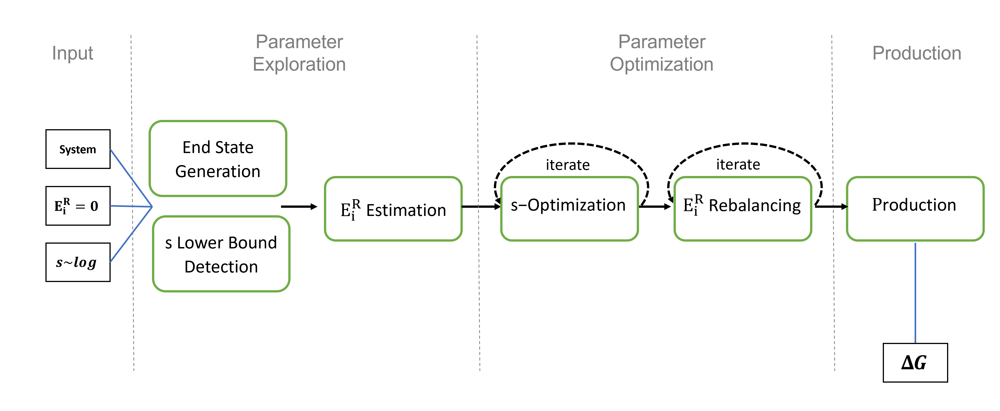

RE-EDS
==============================
[//]: # (Badges)

Replica Exchange - Enveloping Distribution Sampling (RE-EDS) is a method to calculate the relative free energy of multiple states in a system.
It can be applied to calculate relative solvation free energies or relative binding free energies of ligands to a protein. 
One advantage of this method is, that the transition path of one state into another one is not pre-determined thanks to use of Enveloping Distribution Sampling (EDS) by Christ et al. .

The enhanced sampling method Replica Exchange was added by Sidler et al. to speed up the sampling and ease the choice of parameters.  
Additionally multiple modules were described by Sidler to allow an automatization of the pipeline. 
In this repository we now combined these approaches to an automatic scheme for RE-EDS.

The repository aims to make the RE-EDS pipeline accessible to everyone!

For more on RE-EDS checkout:
 * [Efficient Round-Trip Time Optimization for Replica-Exchange Enveloping Distribution Sampling (RE-EDS); Dominik Sidler, Michael Cristòfol-Clough, and Sereina Riniker (2017)](https://pubs.acs.org/doi/abs/10.1021/acs.jctc.7b00286)
 * [Replica exchange enveloping distribution sampling (RE-EDS): A robust method to estimate multiple free-energy differences from a single simulation;  Dominik Sidler, Arthur Schwaninger, and Sereina Riniker (2016)](https://aip.scitation.org/doi/abs/10.1063/1.4964781)

Further reading on EDS:
 * [An Alternative to Conventional λ-Intermediate States in Alchemical Free Energy Calculations: λ-Enveloping Distribution Sampling; Gerhard König, Nina Glaser, Benjamin Schroeder, Alžbeta Kubincová, Philippe H. Hünenberger, and Sereina Rinikerb (2020)](https://pubs.acs.org/doi/abs/10.1021/acs.jcim.0c00520)
 * [Multiple free energies from a single simulation: Extending enveloping distribution sampling to nonoverlapping phase-space distributions; Clara D. Christ and Wilfred F. van Gunsteren (2008)](https://aip.scitation.org/doi/10.1063/1.2913050)

## Structure
This Project contains the code for the RE-EDS workflow of the rinikerlab. In the example folder, you can find the system input data for the pipeline, a template script folder, and several jupyter notebooks covering and explaining certain aspects of the pipeline.
The reeds folder contains some template files, a function library, and ready-to-use scripts for the RE-EDS steps.

Additional:
    The submodule folder contains [PyGromosTools](https://github.com/rinikerlab/PyGromosTools), which is used extensively in the RE-EDS code.
    The subfolder tests are used for the automatic code testing mainly applied to the energy offset estimation and the roundtrip optimizers.

### Code
The code is written in python3 and requires a compiled version of [Gromos](http://gromos.net/).
At the current stage, an LSF queue is required to submit the simulation jobs. 
The required python packages are listed in devtools/conda-envs/full_env.yaml.

## Install
Using this repository, clone it (like the command below) into a directory on your machine and add the path to the repo to your python path.

    git clone --recurse-submodules <repo url>

Make sure you have the required python packages from devtools/conda-envs/full_env.yaml. You can install the provided env with Anacodna like:

    conda env create -f devtools/conda-envs/full_env.yaml

If you want to update the code of the PyGromos submodule, you can do this:

    git submodule init
    git submodule update

Please, if your writing code for this repository, first develop it on an own branch.

     git branch mybranch    #generate your branch
     git checkout mybranch  #switch to your branch
     git merge main   #for adding new features from main to your branch

## Copyright

Copyright (c) 2020, Benjamin Ries, Salomé Rieder, Candide Champion

#### Acknowledgements
 Project-based on the 
[Computational Molecular Science Python Cookiecutter](https://github.com/molssi/cookiecutter-cms) version 1.3.
